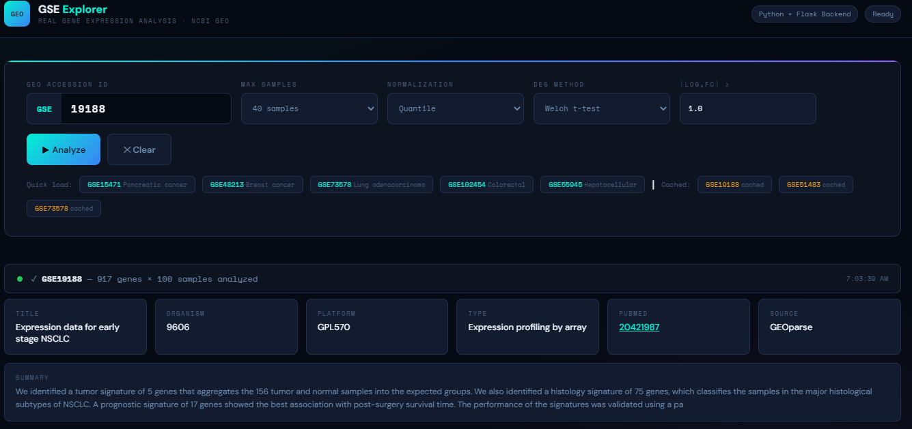

# GSE Explorer — Real Python Flask Gene Expression Analysis App

A full-stack bioinformatics web application for analyzing NCBI GEO gene expression datasets.

---

## Project Structure


```
gse-app/
├── app.py                  ← Flask server (all routes + API)
├── requirements.txt        ← Python dependencies
├── outputs/                ← Generated files (Excel, plots)
├── analysis/
│   ├── __init__.py
│   ├── fetcher.py          ← NCBI GEO data fetching (GEOparse + eutils fallback)
│   ├── preprocessor.py     ← Log2 normalization, quantile normalization, QC
│   ├── deg_analysis.py     ← Welch t-test, Mann-Whitney, BH FDR correction
│   ├── pca_analysis.py     ← PCA (sklearn), hierarchical clustering (scipy)
│   ├── enrichment.py       ← Pathway ORA with Fisher's exact test
│   └── visualizer.py       ← Matplotlib/seaborn plots → base64 PNG
└── templates/
    └── index.html          ← Jinja2 Flask frontend
```

---

## Setup

### 1. Create and activate a virtual environment
```bash
python3 -m venv venv
source venv/bin/activate          # Linux/macOS
# or
venv\Scripts\activate             # Windows
```

### 2. Install dependencies
```bash
pip install -r requirements.txt
```

> **Note:** `GEOparse` requires `wget` for downloading SOFT files. Install it if needed:
> ```bash
> # macOS:  brew install wget
> # Ubuntu: sudo apt install wget
> ```

### 3. Run the app
```bash
python app.py
```

Open your browser at: **http://localhost:5000**

---

## Usage

1. Enter a GSE accession ID (e.g. `GSE15471`, `GSE48213`)
2. Choose normalization method, DEG method, max samples
3. Click **▶ Analyze** — the app will:
   - Fetch real data from NCBI GEO
   - Normalize (log₂ + quantile normalization)
   - Run differential expression analysis (Welch t-test + BH correction)
   - Compute PCA + hierarchical clustering
   - Run pathway enrichment (Fisher's exact test vs KEGG gene sets)
   - Generate 10 real matplotlib/seaborn plots
4. Explore results across 9 tabs
5. Export DEGs, expression matrix, and enrichment to CSV/Excel

---

## API Endpoints

| Method | Endpoint | Description |
|--------|----------|-------------|
| POST | `/api/analyze` | Run full analysis pipeline |
| GET  | `/api/deg_table` | Paginated DEG table (sortable, filterable) |
| GET  | `/api/pca_data` | PCA coordinates JSON |
| GET  | `/api/gene_corr` | Gene correlation matrix |
| GET  | `/api/enrichment` | Pathway enrichment results |
| GET  | `/api/qc_data` | Per-sample QC metrics |
| GET  | `/api/plot/boxplot` | Sample distribution plot (base64 PNG) |
| GET  | `/api/plot/volcano` | Volcano plot (base64 PNG) |
| GET  | `/api/plot/heatmap` | Expression heatmap (base64 PNG) |
| GET  | `/api/plot/pca` | PCA + Scree plot (base64 PNG) |
| GET  | `/api/plot/violin` | Violin + QQ plot (base64 PNG) |
| GET  | `/api/plot/correlation` | Gene correlation heatmap (base64 PNG) |
| GET  | `/api/plot/enrichment` | Pathway enrichment chart (base64 PNG) |
| GET  | `/api/plot/ma` | MA plot (base64 PNG) |
| GET  | `/api/plot/density` | Density curves (base64 PNG) |
| GET  | `/api/plot/dendrogram` | Hierarchical clustering dendrogram (base64 PNG) |
| GET  | `/api/export/degs_csv` | Download DEGs as CSV |
| GET  | `/api/export/degs_excel` | Download full results as Excel (multi-sheet) |
| GET  | `/api/export/expression_csv` | Download normalized expression matrix |
| GET  | `/api/export/enrichment_csv` | Download enrichment results |
| POST | `/api/cache/clear` | Clear GEO data cache |

---

## Analysis Methods

| Step | Method | Implementation |
|------|--------|---------------|
| Normalization | Log₂(x+1) + Quantile | `preprocessor.py` |
| DEG Testing | Welch t-test or Mann-Whitney U | `scipy.stats` |
| FDR Correction | Benjamini-Hochberg | `statsmodels.stats.multitest` |
| Effect Size | Cohen's d | `deg_analysis.py` |
| PCA | TruncatedSVD | `sklearn.decomposition.PCA` |
| Clustering | Complete linkage, Euclidean | `scipy.cluster.hierarchy` |
| Correlation | Pearson r | `pandas.DataFrame.corr` |
| Enrichment | Fisher's exact test (ORA) | `scipy.stats.fisher_exact` |
| Outlier Detection | PCA distance | `sklearn` |
| Visualization | Matplotlib + Seaborn | `visualizer.py` |

---

## Production Deployment

```bash
gunicorn -w 4 -b 0.0.0.0:5000 app:app
```

For larger datasets, use Redis for session storage and Celery for async task processing.

---

## Tested GSE Datasets

| ID | Study | Samples | Platform |
|----|-------|---------|----------|
| GSE15471 | Pancreatic ductal adenocarcinoma | 36 | Affymetrix HG-U133 Plus 2.0 |
| GSE48213 | Breast cancer subtypes | 84 | Illumina HiSeq |
| GSE73578 | Lung adenocarcinoma | 54 | Affymetrix HG-U133 Plus 2.0 |
| GSE102454 | Colorectal cancer | 48 | Agilent |
| GSE55945 | Hepatocellular carcinoma | 60 | Affymetrix |
